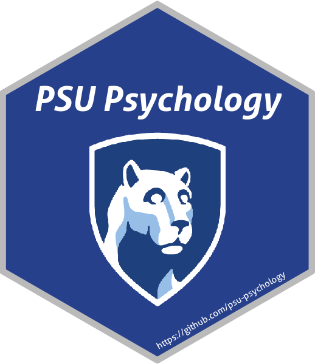

{width=50%}{width=25%}

This website contains a central repository for resources that might be helpful for
new and current graduate students in psychology at Penn State University. You can
access individual webpages with additional resources under the dropdown menu at
the top of this page.

If you would like to add to this repository, you can either follow the instructions for
cloning and adding to the [GitHub repository](https://github.com/psu-psychology/Psych-Grad-Resources),
or contact the current maintainer of the repository.

Current maintainer(s): 

[Daniel Albohn](www.sites.psu.edu/albohn)  
Email: [dna5021@psu.edu](dna5021@psu.edu)  
GitHub: [www.github.com/d-bohn](www.github.com/d-bohn)

