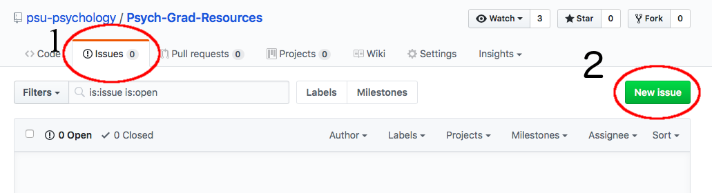

  

If you would like to add to this repository, you can either submit a request through the GitHub page,
follow the instructions for cloning and adding to the repository, or by contact the current
maintainer of the repository.
  
1). Submit an issue (request) on the
[GitHub repository](https://github.com/psu-psychology/Psych-Grad-Resources). Submit an issue
by selecting "Issues" on the GitHub page, and "New issue."  
  

  

2). Clone the whole repository, create a new branch, add any additional
information, rebuild the website, and submit a pull request. This option
requires the use of `git` and GitHub, as well as R Markdown for making
HTML webpages. (Tutorial on how to do this forthcoming).
  

3). Contact someone who knows how to clone repositories and add content, or
the current site maintainer.
  

Current maintainer(s): 

[Daniel Albohn](http://www.sites.psu.edu/albohn)  
Email: dna5021@psu.edu  
GitHub: [www.github.com/d-bohn](http://www.github.com/d-bohn)

________________________________________________________
Last updated on `r Sys.Date()`
